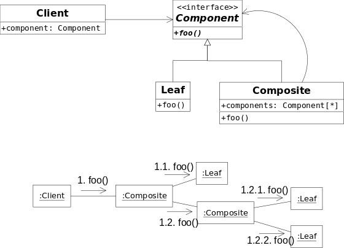
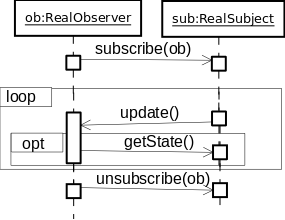

<form target="body" method="get" action="http://www.csci.csusb.edu/dick/cs375/lookup.php">
[<a href="#Main Content">Skip Navigation</a>]
[ <a href="http://csusb.edu">CSUSB </a>]
/ [<a href="http://nsci.csusb.edu/">CNS</a>]
/ [<a href="http://cse.csusb.edu/">CSE</a>]
/ [<a href="http://cse.csusb.edu/dick/">R J Botting</a>]
/ [<a href="http://cse.csusb.edu/dick/cs375/">CS375</a>]
 [Search <input name="search" size="10" value="">

<input type="hidden" name="from" value="cs375/header">
<input type="submit" value="Go">]
 
[About (http://www.csci.csusb.edu/dick/cs375/about.html)]
[Contact (http://www.csci.csusb.edu/dick/cs375/contact.html)]
[Grades (http://www.csci.csusb.edu/dick/cs375/grading/)]
[Objectives (http://www.csci.csusb.edu/dick/cs375/objectives.html)]
[Patterns (http://www.csci.csusb.edu/dick/cs375/patterns.html)]
[Projects (http://www.csci.csusb.edu/dick/cs375/projects.html)]
[Schedule (http://www.csci.csusb.edu/dick/cs375/schedule.html)]
[Syllabus (http://www.csci.csusb.edu/dick/cs375/syllabus.html)]

 Session:
[<a href="http://www.csci.csusb.edu/dick/cs375/01.html">01</a>]
[<a href="http://www.csci.csusb.edu/dick/cs375/02.html">02</a>]
[<a href="http://www.csci.csusb.edu/dick/cs375/03.html">03</a>]
[<a href="http://www.csci.csusb.edu/dick/cs375/04.html">04</a>]
[<a href="http://www.csci.csusb.edu/dick/cs375/05.html">05</a>]
[<a href="http://www.csci.csusb.edu/dick/cs375/06.html">06</a>]
[<a href="http://www.csci.csusb.edu/dick/cs375/07.html">07</a>]
[<a href="http://www.csci.csusb.edu/dick/cs375/08.html">08</a>]
[<a href="http://www.csci.csusb.edu/dick/cs375/09.html">09</a>]
[<a href="http://www.csci.csusb.edu/dick/cs375/10.html">10</a>]
[<a href="http://www.csci.csusb.edu/dick/cs375/11.html">11</a>]
[<a href="http://www.csci.csusb.edu/dick/cs375/12.html">12</a>]
[<a href="http://www.csci.csusb.edu/dick/cs375/13.html">13</a>]
[<a href="http://www.csci.csusb.edu/dick/cs375/14.html">14</a>]
[<a href="http://www.csci.csusb.edu/dick/cs375/15.html">15</a>]
[<a href="http://www.csci.csusb.edu/dick/cs375/16.html">16</a>]
[<a href="http://www.csci.csusb.edu/dick/cs375/17.html">17</a>]
[<a href="http://www.csci.csusb.edu/dick/cs375/18.html">18</a>]
[<a href="http://www.csci.csusb.edu/dick/cs375/19.html">19</a>]
[<a href="http://www.csci.csusb.edu/dick/cs375/20.html">20</a>]

 
[<a href="patterns.txt">Text Version</a>]
 patterns.html 
Thu Mar 21 14:14:04 PDT 2013
 
<h6>Opening the PDF files on this page may require you to download
<a href="http://www.adobe.com/products/acrobat/readstep2.html">
Adobe Reader</a> or an equivalent viewer (GhostScript).</h6>
<h3><a name="Contents">Contents</a></h3>
<ul class="Contents">
 
<li><a href="#Patterns and Principles">Patterns and Principles</a>
</li><li><a href="#What is a Pattern">: What is a Pattern</a>
</li><li><a href="#Domain and Business Model Patterns">: Domain and Business Model Patterns</a>
</li><li><a href="#Software Design Patterns">: Software Design Patterns</a>
</li><li><a href="#GRASP -- General Responsibility Assignment Software Patterns">: GRASP -- General Responsibility Assignment Software Patterns</a>
</li><li><a href="#GoF Patterns">: GoF Patterns</a>
</li><li><a href="#Set of_GoF_Patterns">: : Set of_GoF_Patterns</a>
</li><li><a href="#XP Principles">: XP Principles</a>
</li><li><a href="#Persistence Principles">: Persistence Principles</a>
</li><li><a href="#Exception Principles">: Exception Principles</a>
</li><li><a href="#OO Principles">: OO Principles</a>
</li><li><a href="#Other Principles">: Other Principles</a>
</li><li><a href="#AntiPatterns -- Patterns that occur but don't resolve the forces well">: AntiPatterns -- Patterns that occur but don't resolve the forces well</a>
</li><li><a href="#The Ball of Mud Pattern or God Object">: : The Ball of Mud Pattern or God Object</a>
</li><li><a href="#Good Links on Patterns">: Good Links on Patterns</a>
</li><li><a href="#Standard Definitions">Standard Definitions</a>
</li></ul><a name="Main Content">
 

</a><ol>
<h1><a name="Patterns and Principles">Patterns and Principles</a></h1><ol class="Section">
<h2><a name="What is a Pattern">What is a Pattern</a></h2>
A pattern can be a recurring structure in a domain or business model.  It can be a
pretty useful way of solving a recurring problem in coding a program.  It can
be a recurring way of dividing up the responsibilities (functionaliity) into a maintainable
set of objects.  The key word is
<a name="recurring" class="Key"> recurring </a>
-- if it has not been used 3 times then it is not a pattern.

<h2><a name="Domain and Business Model Patterns">Domain and Business Model Patterns</a></h2>
In a typical busines or doamin model there will be many simple patterns that appear.

The first set of patterns come from the fact that Entity-Relationship modelling is also
business modelling.  The following examples come from my CSE372 (Computers in Organisations) course.
Here are some classic analysis patterns that I've noticed over the years.  Use this list to help
discover ERD models:

<ul class="Set">
<a name="Sentences lead to Relations:" class="Key"> Sentences lead to Relations: </a>
Sentences often describe relationships between entities: Jo Doe is married to Jane Roe. Student
Joe Coyote is enrolled in CSE372. Joe Coyote is working as a Librarian on the "FIS" project
team in CS372.
 <ol class="List">
<li>A simple relationship between only two entities can be shown as simple link. RJBOTTING
teaches CSE372.

</li><li>But many-to-many and n-ary relationships are best treated as entities. For example: An
Enrollment links a Section  to a Student....

</li><li>A sentence can relate entities of the same type.  For example a Marriage relates two People.  The
different occurrences play different roles.  For example in a traditional a Marriage has one
Person who is playing the roll of husband and a second person playing the role of wife.

</li><li>Some sentences describe an entity in terms of its attributes.  When an entity has a property that is
a value of a simple data type: a number, Boolean, character, string, or one of a number of
enumerated values, then it is best shown as an attribute. For example a Person may have
attributes: gender, age, height, ...

</li><li>Notice: an entity can have attributes and be related to other entities. A
Relationship can also have attributes, and be related to other Entities.
However be careful not to record the same fact in multiple
ways.

</li></ol> 

<a name="Master and Detail Pattern" class="Key"> Master and Detail Pattern </a>
Example: A Sale has a number of Items.  An Order has
a number of order items.

<a name="Pattern -- Actor plays a Role for a Time" class="Key"> Pattern -- Actor plays a Role for a Time </a>
A Person can be a Student in a Quarter.  A Person can Work on
campus in a Quarter. They can be a Teacher in another Quarter.  Combinations of roles are
possible at one time.

<a name="Events Time and Place Pattern" class="Key"> Events Time and Place Pattern </a>
Event of a particular Type takes place at a Time and a Place. Example:  CSE372 meets 4-6pm
in JBH146 during winter quarter 2007.

<a name="Description and Instance Pattern" class="Key"> Description and Instance Pattern </a>
Example: A product describes a sales Item.
Also good for entities that are grouped by shared attribute values. Example:
A Course has many Sections.

<a name="Part and Whole Pattern" class="Key"> Part and Whole Pattern </a>
Building has many rooms.  A Week has many days. Dog has 4 legs. Project
has team members.

<a name="Access Point Pattern --" class="Key"> Access Point Pattern -- </a>
An entity selects a collection of entities needed for a
process.  Example: DeansList of Students with GPA&gt;3.9. This example is an
"Operational Master" and expresses a functional requirement as an object.
Another version is when when the Access Point links to a list or set of
objects: for example an Inventory of Items on the shelves in a Store,
a list of people with accounts, a catalog of all the books in a library,
or a Ledger describing resources owned by a enterprise.

<a name="General and Particular Pattern --" class="Key"> General and Particular Pattern -- </a>
A Student and a Teacher are special types of Person.  In an ERD the
special types are shown with a 0..1 multiplicity in the General.  In general,
you can have a whole hierarchy of special types. There are ways to document
whether the special types overlap or not (UML Generalization).  Avoid this detail in
simple ERDs.

<a name="The Enumeration pattern" class="Key"> The Enumeration pattern </a>
It is very common to define an entity type not by its relationships and attributes,
but by listing its possible values.  For example: Gender, Race, Boolean, ... Either document the
values elsewhere or use the &lt;&lt;enumeration&gt;&gt; stereotype in the UML for the second of these. Do
not confuse listing the attributes of an entity: Person has age, gender, eye color, ... with listing the
possible values of an
enumerated date type: Gender = {male, female, unknown}.
Another example: student status = (fresher, sophomore, junior, senior, graduate).

By the way it is a common error to forget the "&lt;&lt;enumeration&gt;&gt;" and so turn the possible values of
a simple entity into the attributes of a complex and erroneous one.

</ul>

<h2><a name="Software Design Patterns">Software Design Patterns</a></h2>
Reoccuring solutions to complex and subtle problems in software design -- for example
allowing the software to work with an expanding number of interface frameworks without
recompiling everything each time.
See
[<a href="http://en.wikipedia.org/wiki/Software_design_pattern"> Software_design_pattern </a>]
on the Wikipedia.
<h2><a name="GRASP -- General Responsibility Assignment Software Patterns">GRASP -- General Responsibility Assignment Software Patterns</a></h2>

<li><a name="Expert">Expert</a>::=allocate a responsibility to a class that has the information. Look
in both the design classes and the domain model to find a type of object
that knows enough to handle the responsibility.  Knowledge includes
having the data, and also knowing who has got the data!  Sketch

</li><li><a name="Creator">Creator</a>::=creating an object should be the responsibility of a class that is closely related to the created object.  Notice that you always need at least
one way of creating an object that doesn't depend on already having an object
of that type already.  So which class or object is close to the
created object.  Sketch

Or else you can use a GoF <a href="#Factory">Factory</a> -- a
<a href="#Pure_Fabrication">Pure_Fabrication</a>.

</li><li><a name="Low_coupling">Low_coupling</a>::=Assign a responsibilities so that class depends less on other classes using a "need to know basis". Organize responsibilities so that classes do not depend on each other two much.

</li><li><a name="High_cohesion">High_cohesion</a>::=Design elements to have strongly related and focused responsibilities".

</li><li><a name="Controller">Controller</a>::=Assign the responsibility for handling system event messages to a class representing either the whole system, device, or subsystem, or representing the use case /scenario within which the system event occurs.
Controllers often translate <a href="#IDs_to_Objects">IDs_to_Objects</a> where the objects are in
the Domain Layer and are Information Experts.
Note: Choose controllers carefully to avoid low cohesion.

Compare
[<a href="patterns.html#MVC"> MVC </a>]
(Model-View-Controller)
and see <a href="#IDs_to_Objects">IDs_to_Objects</a> below.

</li><li><a name="Polymorphism">Polymorphism</a>::=`Give the same name to services in different objects when
the services are similar or related`. Classify objects, using
inheritance/generalization, to allow the right version of a service to be
executes for the object in question.
You can call
all your Pets in the same way.... and the Dogs come to you, and the Cats
think about it, for example.

Example
[<a href="patterns.html#Strategy"> Strategy </a>]
in the <a href="#GOF">GOF</a> patterns below.

</li><li><a name="Pure_Fabrication">Pure_Fabrication</a>::=assigning a highly cohesive set of responsibilities to an artificial convenience class that doesn't represent a problem domain concept.

</li><li><a name="Indirection">Indirection</a>::=Assign a responsibility to a class that knows where to find an object that can complete the task, Avoid coupling by an intermediate (smart?) object.

You can have indirect access to an abstraction without knowing
the precise concrete implementation of the abstraction.
<a href="#Polymorphism">Polymorphism</a> makes sure you get the right behavior.

</li><li><a name="PV">PV</a>::=Protected_variation.
</li><li><a name="Protected_Variations">Protected_Variations</a>::=Identify points of predicted variation or instability and assign responsibilities to create a stable interface around them.
 <ol class="List">
<li>Parnas: Separate your design decisions into separate modules. See <a href="#Parnas">Parnas</a>.
</li><li>SDM: Separate physical from logical structures in separate processes.
</li><li>GoF: <a href="#Template_Method">Template_Method</a>, <a href="#Facade">Facade</a>, <a href="#Proxy">Proxy</a>, <a href="#Adapter">Adapter</a>,...
</li></ol> 
<h2><a name="GoF Patterns">GoF Patterns</a></h2><ol class="Section">
<li><a name="GoF">GoF</a>::="The Gang of Four".... see <a href="#GoF_book">GoF_book</a> and
</li><li><a name="The_Gang_of_Four">The_Gang_of_Four</a>::abbreviation={Erich Gamma, Richard Helm, Ralph Johnson, John Vlissides}, Four <a href="#OO">OO</a> thinkers who wrote an influential book of design patterns.
</li><li><a name="GoF_book">GoF_book</a>::=following,
[<a href="http://csci.csusb.edu/dick/biba.php?from=patterns&amp;search=Gammaetal94"><cite>Gammaetal94</cite></a>]
, note -- uses a pre-UML notation.
<h3><a name="Set of_GoF_Patterns">Set of_GoF_Patterns</a></h3>
{<a href="#Abstract_factory">Abstract_factory</a> , <a href="#Adapter">Adapter</a> , <a href="#Bridge">Bridge</a> , <a href="#Builder">Builder</a> , <a href="#Command">Command</a> , <a href="#Composite">Composite</a> , <a href="#Decorator">Decorator</a> , <a href="#Facade">Facade</a> , <a href="#Flyweight">Flyweight</a> , <a href="#Interpreter">Interpreter</a> , <a href="#Iterator">Iterator</a> , <a href="#Mediator">Mediator</a> , <a href="#Observer">Observer</a> , <a href="#Prototype">Prototype</a> , <a href="#Proxy">Proxy</a> , <a href="#Singleton">Singleton</a> , <a href="#Strategy">Strategy</a> , <a href="#State">State</a> , <a href="#Template_Method">Template_Method</a> , <a href="#Visitor">Visitor</a>}

<a name="Links on the Gang of Four patterns." class="Key"> Links on the Gang of Four patterns. </a>
THe Wikipedia has articles of varying quality on the <a href="#GoF">GoF</a> patterns. Here
[<a href="http://en.wikipedia.org/wiki/Design_Patterns_(book)"> Design_Patterns_(book) </a>]
is a link to a description of the book.
Here
[<a href="http://pw.tech-arts.co.jp/download/design_pattern/"> http://pw.tech-arts.co.jp/download/design_pattern/ </a>]
are some quite good UML diagrams but I'm not sure of the descriptions.
And the WikiWikiWeb
[<a href="http://c2.com/cgi/wiki?DesignPatterns"> wiki?DesignPatterns </a>]
discusses them all -- but is short of diagrams (if you like diagrams).
More links:
[click here  if you can fill this hole]

Many <a href="#GoF">GoF</a> combine two or more <a href="#GRASP">GRASP</a> patterns.  For example <a href="#State">State</a>
is a <a href="#Pure_Fabrication">Pure_Fabrication</a> that uses <a href="#Indirection">Indirection</a> to protect
a class from state changes (<a href="#PV">PV</a>).

</li><li><a name="Abstract_factory">Abstract_factory</a>::<a href="#GoF">GoF</a>=To allow a client to create an object without knowing what type of object it is design a common interface for creating families of similarly or related objects.
See <a href="#Factory">Factory</a>.
This is an example of a <a href="#Pure_Fabrication">Pure_Fabrication</a> that uses <a href="#Polymorphism">Polymorphism</a> to <a href="#Protect_Variations">Protect_Variations</a>.
[<a href="http://c2.com/cgi/wiki?AbstractFactoryPattern"> wiki?AbstractFactoryPattern </a>]

[<a href="http://en.wikipedia.org/wiki/Abstract_Factory"> Abstract_Factory </a>]
(article).

</li><li><a name="Adapter">Adapter</a>::<a href="#GoF">GoF</a>=Introduce a class to convert the interface of one component into another interface.  Think plugs and sockets. make one interface for one or more suppliers.
Unlike <a href="#Proxy">Proxy</a> and <a href="#Bridge">Bridge</a>, an adapter converts different interfaces into one common one.
Uses pure fabrication to protect variation in an interface and ise
indirection and polymorphism to make easy to extend.

(general form)
and code
[<a href="fig25_25_1.cpp"> fig25_25_1.cpp </a>]
[<a href="test.fig25_25_1.cpp"> test.fig25_25_1.cpp </a>]
(From Larman05)

</li><li><a name="Bridge">Bridge</a>::<a href="#GoF">GoF</a>=A class of objects that acts as an interface between clients and an implementation.
Unlike an <a href="#Adapter">Adapter</a> the <a href="#Bridge">Bridge</a> connects to a family of objects with the same operations.
<a href="http://c2.com/cgi/wiki?BridgePattern"> wiki?BridgePattern </a>
<a href="http://pw.tech-arts.co.jp/download/design_pattern/images/bridge_s.jpg"> bridge_s.jpg </a>
<a href="http://en.wikipedia.org/wiki/Bridge_pattern"> Bridge_pattern </a>

</li><li><a name="Builder">Builder</a>::<a href="#GoF">GoF</a>=How to constuct complex objects with varying parts? A director calls various builders as needed, a variation on the <a href="#Factory">Factory</a> patterns.
[<a href="http://en.wikipedia.org/wiki/Builder_pattern"> Builder_pattern </a>]
[<a href="http://c2.com/cgi/wiki?BuilderPattern"> wiki?BuilderPattern </a>]

</li><li><a name="Chain_of_Responsibillity">Chain_of_Responsibillity</a>::<a href="#GoF">GoF</a>=Attach responsibillities to a linked list of abstract handlers each is a special concrete handler.
[click here  if you can fill this hole]

</li><li><a name="Command">Command</a>::<a href="#GoF">GoF</a>=Design objects that know how to do (and undo) a family of tasks and pass them to other objects to be used as needed.
[<a href="http://c2.com/cgi/wiki?CommandPattern"> wiki?CommandPattern </a>]

</li><li><a name="Composite">Composite</a>::<a href="#GoF">GoF</a>=Make complex and simple kinds of an object share behavior. And often the complex objects keep a list of their parts: each of which is a similar kind of object.

[<a href="http://c2.com/cgi/wiki?CompositePattern"> wiki?CompositePattern </a>]
[<a href="http://www.dofactory.com/Patterns/PatternComposite.aspx"> PatternComposite.aspx </a>]

</li><li><a name="Decorator">Decorator</a>::<a href="#GoF">GoF</a>=A class can take an object and wrap new functions around it.

[<a href="decorator.gif"> decorator.gif </a>]
(complex diagram)
[<a href="http://cse.csusb.edu/dick/cs375/TestDecorator.java"> TestDecorator.java </a>]
[<a href="http://c2.com/cgi/wiki?DecoratorPattern"> wiki?DecoratorPattern </a>]

</li><li><a name="Wrapper">Wrapper</a>::=<a href="#Decorator">Decorator</a>.

</li><li><a name="Facade">Facade</a>::<a href="#GoF">GoF</a>=A class or object provides a single point of entry for services of a subsystem, Hide a complex system of objects behind a single object. Pay no attention to the man behind the curtain.
[<a href="http://c2.com/cgi/wiki?FacadePattern"> wiki?FacadePattern </a>]
[<a href="http://www.dofactory.com/Patterns/PatternFacade.aspx"> PatternFacade.aspx </a>]
[<a href="http://en.wikipedia.org/wiki/Facade_pattern"> Facade_pattern </a>]

</li><li><a name="Factory">Factory</a>::=an object/operation/class is designed solely to create other kinds of object.
A factory is an alternative to a <a href="#Creator">Creator</a> that calls the
constructor in a class.  Because it
is a member of a different class (the factory) we can get objects without
having to know precisely what class they are instances of.  Other
patterns need the ability to create concrete implementations of
an abstraction -- but without knowing which implementation has been
chosen.
This is not a GoF pattern,
see <a href="#Abstract_factory">Abstract_factory</a>, <a href="#FactoryMethod">FactoryMethod</a>, and <a href="#Builder">Builder</a>.

</li><li><a name="FactoryMethod">FactoryMethod</a>::=an operation that creates an object.  THis provides flexibillity
that a constructor is not able to provide -- for example different names
or run time selection of the concrete type of object.
Typically there is
a hierarchy of classes all providing the same operation to create objects of
different types.  Similarly the resulting object should be a specific
object in a hierarchy of products.

(From Wikimedia)
See
[<a href="http://en.wikipedia.org/wiki/Factory_method_pattern"> Factory_method_pattern </a>]
on the Wikipedia.

</li><li><a name="Flyweight">Flyweight</a>::<a href="#GoF">GoF</a>=when you have lots of small similar objects keep exemplas ina data structure and point to those for the details.
[<a href="http://c2.com/cgi/wiki?FlyweightPattern"> wiki?FlyweightPattern </a>]
[<a href="http://en.wikipedia.org/wiki/Flyweight_pattern"> Flyweight_pattern </a>]
Classic example: characters in wordprocessing.  Used for <a href="#State">State</a> and <a href="#Strategy">Strategy</a>.  Used with <a href="#Composite">Composite</a>.

</li><li><a name="Interpreter">Interpreter</a>::<a href="#GoF">GoF</a>=Complex rules and formulas are encoded as expressions that can be evaluated. An abstract Expression can be a terminal or nonterminal expression and nonterminal expression have many abstract parts in them.
[<a href="http://www.dofactory.com/Patterns/Diagrams/interpreter.gif"> interpreter.gif </a>]
[<a href="http://www.dofactory.com/Patterns/PatternInterpreter.aspx"> PatternInterpreter.aspx </a>]
[<a href="http://www.vincehuston.org/ps/hanoi_article.html"> hanoi_article.html </a>]
(Includes <a href="#Composite">Composite</a> and Inpterpreter as an OO solution of the Classic
Towers of Hanoi problem). Here
[<a href="http://stackoverflow.com/questions/1020622/is-interpreter-an-anti-pattern"> is-interpreter-an-anti-pattern </a>]
is a discussion of whether Interpreter is actually a bad idea (and
Anti-Pattern) and a smarter move is just to embed a ready made laguage and
interpreter.

</li><li><a name="Iterator">Iterator</a>::<a href="#GoF">GoF</a>=Provide access to each item in a container in turn, A typical iterator
has operations that return: first(), next(), isDone(), currentItem().  Alternative
is <a href="#Visitor">Visitor</a>.
[click here <a href="hole.html">Iterator</a> if you can fill this hole]

</li><li><a name="Mediator">Mediator</a>::<a href="#GoF">GoF</a>=A collection of Colleagues work together without direct coupling because they use a Mediator object.
[click here <a href="hole.html">Mediator</a> if you can fill this hole]

</li><li><a name="Memento">Memento</a>::<a href="#GoF">GoF</a>=An object creates a memento of a particular event that is passed to a caretaker until the state has to be recalled.
[click here <a href="hole.html">Memento</a> if you can fill this hole]

</li><li><a name="Observer">Observer</a>::<a href="#GoF">GoF</a>=An object that implements the operations that let it subscribe to learn about other objects.
Objects that need to see what an object is doing can join a collection
maintained by the observed object.  These are subscribers. The observed
object publishes the changes to the subscribers using one or more special
operations that a listed in an interface that the observers all implement.
It is also possible for an object to subscribe other objects as observers.

[<a href="http://c2.com/cgi/wiki?ObserverPattern"> wiki?ObserverPattern </a>]
[<a href="http://www.dofactory.com/Patterns/PatternObserver.aspx"> PatternObserver.aspx </a>]

</li><li><a name="Prototype">Prototype</a>::<a href="#GoF">GoF</a>=Create objects by asking an object to clone itself, all concrete prototypes share a common clone() interface.
[click here  if you can fill this hole]

</li><li><a name="Proxy">Proxy</a>::<a href="#GoF">GoF</a>=Design an object that can stand in for other objects and knows which object it is representing and how to simulate it.  As a result we can change the real object with out breaking the client.

[<a href="http://c2.com/cgi/wiki?ProxyPattern"> wiki?ProxyPattern </a>]

</li><li><a name="Singleton">Singleton</a>::<a href="#GoF">GoF</a>=To make sure that there is precisely one object in a class and provide access to it.

[<a href="Singleton.pdf"> Singleton.pdf </a>]
[<a href="singleton.cpp"> singleton.cpp </a>]
[<a href="test.singleton.cpp"> test.singleton.cpp </a>]
[<a href="http://c2.com/cgi/wiki?SingletonPattern"> wiki?SingletonPattern </a>]
[<a href="http://www.dofactory.com/Patterns/PatternSingleton.aspx"> PatternSingleton.aspx </a>]

</li><li><a name="Strategy">Strategy</a>::<a href="#GoF">GoF</a>=Place different ways to do something behind a common interface and use indirection via an object to pick the right one.
[<a href="http://c2.com/cgi/wiki?StrategyPattern"> wiki?StrategyPattern </a>]
[<a href="http://www.dofactory.com/Patterns/PatternStrategy.aspx?"> PatternStrategy.aspx? </a>]

</li><li><a name="State">State</a>::<a href="#GoF">GoF</a>=When an object changes behaviors (responsibilities) with time, place the state in a different State object and place the different behaviors in special kinds of State object.
Note: in most programming language can not change its class!  Also
note that an efficient State implementation can use <a href="#Singleton">Singleton</a> for
the states.
[<a href="http://c2.com/cgi/wiki?StatePattern"> wiki?StatePattern </a>]
(on the WikiWikiWeb).  Examples:
[<a href="StatePatternExample.html"> StatePatternExample.html </a>]
[<a href="test.State.cpp"> test.State.cpp </a>]
[<a href="State.cpp"> State.cpp </a>]
(using lazy <a href="#Singleton">Singleton</a> and a "call back")
OR
[<a href="State2.cpp"> State2.cpp </a>]
(using eager <a href="#Singleton">Singleton</a>, breaking <a href="#CQS">CQS</a> principle, and hiding the initial state)
[<a href="test.State2.cpp"> test.State2.cpp </a>]
, Exercise: redraw the UML diagram to show the changed classes between
State and State2.

</li><li><a name="Template_Method">Template_Method</a>::<a href="#GoF">GoF</a>=A method in a class can use abstract operations (hooks) that are defined in a subclass so that the subclass provides some functionality while using the overall method.
The classic example is a method that sorts a vector of data in a Sortable class
but uses an undefined "less_than" operation.  Other classes extend the Sortable and define "less_than" and can then sort the data Their way, right away.
[<a href="http://c2.com/cgi/wiki?TemplateMethodPattern"> wiki?TemplateMethodPattern </a>]
This result is also called a Framework.

</li><li><a name="Visitor">Visitor</a>::<a href="#GoF">GoF</a>=A visitor object can be taken to many or all the items in a data structure visiting each one and gathering information,
All visitors must implement the same interface which is called by the elements in an
accept method.  Diferent types of element can use different operations in the interface
if necesary.
[click here  if you can fill this hole]

</li></ol>
. . . . . . . . . ( end of section <a href="patterns.html#GoF Patterns">GoF Patterns</a>)  <a href="#Contents">&lt;&lt;</a>Contents | End<a href="#__End">&gt;&gt;</a>

<h2><a name="XP Principles">XP Principles</a></h2>
</li><li><a name="DRY">DRY</a>::=Don't repeat yourself.
</li><li><a name="YAGNI">YAGNI</a>::=You Aint' Gonna Need It.  When in doubt leave it out! Keep It Simple Stupid!
Only analyse, design, implement,
and test a function that your client actually needs now.
<h2><a name="Persistence Principles">Persistence Principles</a></h2>
</li><li><a name="tables">tables</a>::=All data can be expressed by a collection of simple tables.

</li><li><a name="Persistence_as_a_superclass">Persistence_as_a_superclass</a>::=`Put all the persistence code into a superclass
and then any class can become persistent by inheriting from the persistence class`.
Notice that this can get clumsy and in Java foul up more important extensions.

</li><li><a name="ACID">ACID</a>::principle="Atomic, Consistent, Isolated, and Durable".
Jim Gray's ACID principles of Data Base transactions.
<ul class="Set">
<li><a name="atomic">atomic</a>::=a transaction either completes or does nothing. -- no interrupts.
</li><li><a name="consistent">consistent</a>::=a transaction never leaves the data in a state that breaks the rules. A marriage has two people: no more, no less.
</li><li><a name="isolated">isolated</a>::=The effect of a transaction is hidden from other transactions until it is complete.
</li><li><a name="durable">durable</a>::=A transaction, once completed, is never lost -- even if things break down or fail.
</li></ul>

</li><li><a name="database_mapper">database_mapper</a>::=The class of the object determines what data needs to be stored so define objects for each class to handle the tables.

</li><li><a name="cache_management">cache_management</a>::=Databases should manage their own caches.

</li><li><a name="hide_SQL">hide_SQL</a>::=Put all the SQL in one object -- a <a href="#singleton">singleton</a> -- and keep it separate from the rest of the code. Treats SQL as an external entity with its own secrets.
See <a href="#Parnas">Parnas</a>.

<h2><a name="Exception Principles">Exception Principles</a></h2>
</li><li><a name="Convert_exceptions">Convert_exceptions</a>::=If you can not handle an exception then convert it to a higher level exception.
</li><li><a name="Name_the_problem_not_the_thrower">Name_the_problem_not_the_thrower</a>::=name exceptions to indicate what is wrong not where it came from.
</li><li><a name="centralize_error_logging">centralize_error_logging</a>::pattern. Have a single object that is responsible for recording bad things.
</li><li><a name="standard_error_dialog">standard_error_dialog</a>::pattern. Have a standard user interface for reporting and sorting out errors.
<h2><a name="OO Principles">OO Principles</a></h2>
</li><li><a name="IDs_to_Objects">IDs_to_Objects</a>::="An object is more than its ID or Key and more useful", so
when you are given an identifier or key you should replace it by the
correct object as soon as possible. So, for example a <a href="#Controller">Controller</a> will
find the object that fits the ID.  The are several places the controller
can look to find(id) including an internal data structure listing all the
possible objects.   But using a data structure in the Controler means
that the controller becomes responsible
for updating this list -- which means lower cohesion.  The Controler can not
send the find(ID) to the object because the object has not been found yet!
In Larman's text book in Chapter 17 the Controller Register sends the
Store a request to find the customer with a particular ID.

Of course, the Creator of an object has the information to store IDs and
their objects.  So a simple solution is to use the metaclass (where the
Constructor is).
The diagram below shows the <a href="#Controller">Controller</a> using a static
function to ask the Class that created the objects which one matches the
id.  The returned object is then sent on to other objects to get the work
done:-

So, the creator Class in the above diagram will probably declare (in C++):

<pre> 		private: string id;</pre>
<pre> 		private: static map&lt;string, *Object&gt; objects;</pre>
<pre> 		public:  static Object* find(string id){return objects[id];</pre>
<pre> 		private: void addThis(string id){objects[id]=this;}</pre>
<pre> 		private: void removeThis(){objects.delete(Pair(this-&gt;id, this);}</pre>
<pre> 		public: Class(string id, ...) {... addThis(id); ...}</pre>
Note the above code needs testing and adapting to the particular situation.

If the exact class of the object is not known, the Controller cannot
turn to that class to find the id. For example, when I login
to MyCoyote it does not know whether I am a student or a faculty member,
until it looks up my ID.  In this case we might well have decided to
use a <a href="#Factory">Factory</a> object to construct the object we need.  The top level
one can keep track of all the IDs and the specific objects that are needed.
Then we use <a href="#Polymorphism">Polymorphism</a>:

<pre> 	Abstract_Class * object = Factory.getInstance().find(id);</pre>
</li><li><a name="The Factory">The Factory</a>::find(id) will return the address of an object in
one of the special concrete classes.  For example, it can return a Faculty
object or a Student object as a special kind of Person class, by <a href="#abstraction">abstraction</a>.

</li><li><a name="OO">OO</a>::=Object Oriented Principles, including <a href="#abstraction">abstraction</a>, <a href="#extension">extension</a>, <a href="#polymorphism">polymorphism</a>, etc.

</li><li><a name="OID">OID</a>::=Objects should know their own identity... and this can be expressed as a simple data item and stored in data tables, and hidden from the user.

</li><li><a name="abstraction">abstraction</a>::<a href="#OO">OO</a>=Variables and parameters should be declared as reference or pointers to abstract data types whenever possible, and containers as holding pointers to abstractions.
Also known as
<a name="Aim high" class="Key"> Aim high </a>
-- allow your pointers to refer to abstractions
and then they can point to many special kinds of object.
For example(in C++):
 <ol class="List">
<li>Declare variable abstract and assign address of concrete:
<pre> 		List * example = new SpecialKindOfList(....);</pre>
<pre> 		Person * dick = new Faculty(....);</pre>

</li><li>Declare parameters as refs to abstractions
<pre> 		void zark(List &amp;w){....}</pre>
</li><li>Declare containers as containing pointers to abstractions:
<pre> 		map&lt;string, Person*&gt; people;</pre>
<pre> 		people.insert(string("Dick"), dick);</pre>
</li></ol> 

</li><li><a name="extension">extension</a>::<a href="#OO">OO</a>=Extend classes rather than reinventing the wheel.
<a href="#Polymorphism">Polymorphism</a> lets you add new functions to a class by putting them in a
subclass.  This can be separately compiled and linked into the running
system without having to compile the base class.

</li><li><a name="polymorphism">polymorphism</a>::<a href="#OO">OO</a>=let objects sweat the details for you. See
GRASP <a href="#Polymorphism">Polymorphism</a>

<h2><a name="Other Principles">Other Principles</a></h2>
</li><li><a name="Parnas">Parnas</a>::=place different decisions in different modules, for example
<ul class="Set">
<li>1971: Put input, output, and logic in separate modules that communicate by function calls.
</li><li>Separate the physical from the logical.  For example: physical=magnetic tape,
logical=sequence of records.
</li><li>Hide a data structure inside an Abstract Data Type -- -- --(<a name="ADT">ADT</a>) 
</li><li>Hide an algorithm behind a <a href="#Strategy">Strategy</a>.
</li><li>Hide external systems behind a <a href="#Facade">Facade</a>.
</li><li>Hide communications between parts inside a <a href="#Mediator">Mediator</a>.
</li><li>Hide libraries behind a <a href="#Facade">Facade</a>, an <a href="#Adapter">Adapter</a>, or a <a href="#Bridge">Bridge</a>.
</li><li>Hide SQL inside a package or object (<a href="#hide_SQL">hide_SQL</a>).
</li><li>Hide the User inside a User_interface (UI) Package.
</li><li>Separate particular Applications from Business Logic and Domain classes.
</li><li>Separate Model, View, and <a href="#Controller">Controller</a>. See <a href="#MVC">MVC</a>
</li><li>Hide a RDBMS behind a simple <a href="#OO">OO</a> persistence layer.
</li></ul>

</li><li><a name="CQS">CQS</a>::=Command_Query_Separation,
</li><li><a name="Command_Query_Separation">Command_Query_Separation</a>::principle=Operations should either do something and return nothing or return something and do nothing, NOT both,
 <ol class="List">
<li>void doSomething(data);// nothing returned
</li><li>Type getSomething(data);//leaves everything the same.
</li></ol> 
This dates back to the the theory of abstract data types and was
inherited by Meyer into objected oriented  coding style.
This principle leads to code that is slightly more verbose
but very much clearer.  It also reduces bugs by the principle of
<a href="#Least_Surprise">Least_Surprise</a>.

</li><li><a name="Least_Surprise">Least_Surprise</a>::principle=`Whenever you design anything choose a design that
minimizes the surprises that the user may experience`.
Henry Ledgard proposed this for programming languages but it
also applies to user interfaces, common appliances, and object-oriented
classes.  Apple had a tendency to extend so that the user experiences
occasional pleasant surprises:  the user does the wrong thing
and the system does the right thing.  This is also called
</li><li><a name="DWIM">DWIM</a>::="Do What I Mean".
This is a dangerous philosophy because it back fires.

</li><li><a name="Model_View_controller">Model_View_controller</a>::pattern=<a href="#MVC">MVC</a>.
[<a href="http://www.pns.anl.gov/images/sciandproj/isaw/mvc.gif"> mvc.gif </a>]
</li><li><a name="MVC">MVC</a>::pattern="Model-View-Controller",
<ul class="Set">
This patterns suggests separating
the logic of the data (Model) from the code that interfaces with the user
(View+Controler).
<li>Separate Model (data + ...) from View(what the user sees...) from Control (what the user can do...).
[<a href="MVCinUML.gif"> MVCinUML.gif </a>]
(UML diagram of View, Controller and Model packages)
</li><li>In some methods yo split Boundary, Control and Entity objects.
And use special icons for them:
[<a href="icons.gif"> icons.gif </a>]
(Graphic showing common icons and stereotypes).

The code that describes user interfaces is independent of the code
for the logic of an enterprise or application.  The appearance of
the user interface for a pay-roll should be separated from the
rules for calculating your with-holdings.
Neither should the choice of the user interface framework change
the calculations.  So the wise designer splits all the
user interface code into specialized classes that communicate
with the application specific classes.  This is splitting
the users "View" from the logical "Model".
As a result the "Model" classes can reflect the Domain or Business
model and so are easier to understand and get right... and keep right.

As a result you can change the View (add a new one, rip out the AWT and
put in Swing, ...) without worrying about the payroll logic.

Here is a paper
[<a href="http://doi.acm.org/10.1145/1121341.1121453"> 1121341.1121453 </a>]
that has a set of Java programs that access a time server and show the
user the time of day found on that server.  One program has a command line
interface, one has a menu driven ASCII interface and one a GUI interface,
but they share a common "model" of how to access the time server.  This
class never changes... each interface is implemented as a new class that
uses the model:

 Model">

The diagrams in the paper are not correct UML, do not use them!

In general, there are lots of classes defining the user interface and
many classes in the Model.  In the UML use packages to contain them.

More strictly the user interface code is split into two sets of classes.
The View and the Controler.  Typically the user communicates with controlers
that change the model.  The view classes get data from the model
and are responsible for rendering it to the user.

<pre> 		User ---&gt; Controler ----&gt; Model -----&gt; View -----&gt; User</pre>

</li><li>Also see
[<a href="http://en.wikipedia.org/wiki/Model-view-controller"> Model-view-controller </a>]
for the history and a list of frameworks that use MVC.

</li></ul>
</li><li><a name="FURPS+">FURPS+</a>::requirements={Functional, Usability, reliability, Performance, supportability, Implementation, Interface, Operations, Packaging, Legal},
Grady92.

</li><li><a name="KISS">KISS</a>::=Keep It Simple, Stupid, see <a href="#XP">XP</a>.<a href="#YAGNI">YAGNI</a>.
"Do the simplest thing that could possibly work."

</li><li><a name="PQRST">PQRST</a>::requirements={Purposes, Qualities, Realities, Systems, Techie}, from <a href="#RJB">RJB</a>.
 Net
<ol>
<li>Purposes include functions and use cases and define why someone
wants the software. To help us sell items to customers.
</li><li>Qualities are the needed properties of the software
like security and performance criteria.
</li><li>Realities are domain models. We have the problem of integrating   different
views of the the real world
</li><li>Systems are the existing systems that we are replacing, using, modifying,
and even competing with.
</li><li>Techie include technologies, techniques, etc. and
describe what and how we might construct the software -- the decisions
we make: eg.-- use VB and MySQL.
</li></ol> (End of Net)
 

</li><li><a name="The_Hollywood_Principle">The_Hollywood_Principle</a>::pattern="Don't call us, we will call you",
This is a common implementation
pattern for interacting with a framwork or operating system.  Instead of the program calling
the operating system when it needs to something, it waits to be called by the environment when events
happen. Detail at
[<a href="http://en.wikipedia.org/wiki/Hollywood_Principle"> Hollywood_Principle </a>]
on the Wikipedia.
The <a href="#GoF">GoF</a> <a href="#Observer">Observer</a> pattern uses the Hollywood Priciple.
The classic <a href="#GoF">GoF</a> <a href="#State">State</a> pattern uses it to change the state.

<h2><a name="AntiPatterns -- Patterns that occur but don't resolve the forces well">AntiPatterns -- Patterns that occur but don't resolve the forces well</a></h2><ol class="Section">
<h3><a name="The Ball of Mud Pattern or God Object">The Ball of Mud Pattern or God Object</a></h3>
Defined in
[<a href="http://en.wikipedia.org/wiki/God_object"> God_object </a>]
on the Wikipedia.

You should read and study this an excellent, short, and readable
blog entry
[<a href="http://www.codinghorror.com/blog/archives/001003.html"> 001003.html </a>]
describing the ways in which system and software architecture goes astray
and ultimately becomes unmanageable.

</ol>
<h2><a name="Good Links on Patterns">Good Links on Patterns</a></h2>
A good list, overview and, discussion of patterns
can be found at
[<a href="http://c2.com/cgi/wiki?CategoryPattern"> wiki?CategoryPattern </a>]
on the WikiWikiWeb.

Another source of pattern information is
[<a href="http://www.dofactory.com/Patterns/Patterns.aspx"> Patterns.aspx </a>]
but this is biased towards C# and is an advert for $2,000 courses.

Here is a nice resource
[<a href="http://home.earthlink.net/~huston2/dp/"> http://home.earthlink.net/~huston2/dp/ </a>]
and visual
[<a href="http://home.earthlink.net/~huston2/dp/patterns.html"> patterns.html </a>]
provided by Vince Huston.  Here is a quiz
[<a href="http://home.earthlink.net/~huston2/dp/patterns_quiz.html"> patterns_quiz.html </a>]

The Wikipedia
[<a href="http://en.wikipedia.org/wiki/"> http://en.wikipedia.org/wiki/ </a>]
also documents many (if not all) patterns
[<a href="http://en.wikipedia.org/wiki/Category:Software_design_patterns"> Category:Software_design_patterns </a>]
here.

Paul Wagner
[<a href="http://csci.csusb.edu/dick/biba.php?from=patterns&amp;search=Wagner05"><cite>Wagner05</cite></a>]
Has listed a dozen commain model patterns:
[<a href="domainPatterns.png"> domainPatterns.png </a>]
that are useful in domain or business modelling.

Narasimha Bolloju
[<a href="http://csci.csusb.edu/dick/biba.php?from=patterns&amp;search=Bolloju04"><cite>Bolloju04</cite></a>]
[<a href="http://csci.csusb.edu/dick/biba.php?from=patterns&amp;search=BollojuLeung06"><cite>BollojuLeung06</cite></a>]
claims that if you know about a dozen common domain model patters
then you make better models, quicker.
Here is a visual summary
[<a href="19Bolloju04.gif"> 19Bolloju04.gif </a>]
of the following list

</li><li><a name="Collaboration_patterns">Collaboration_patterns</a>::#Pattern=following,
<ul class="Set">
<li>E1: Role (1)-(0..*) Transaction
</li><li>E6: Transaction (1)-(0..*) FollowupTransaction
</li><li>E5: Specification (1)-(0..*) Transaction
</li><li>E3: CompositeTransaction (1)&lt;*&gt;-(0..*) LineItem
</li><li>E2: Place (1)-(0..*) Transaction
</li><li>R: Actor (1)-(0..*) Role
</li><li>T1: Item (1)-(0..*) SpecificItem
</li><li>T4: Group (1)&lt;&gt;-(0..*) Member
</li><li>E4: SpecificItem (1)-(0..*) Transaction
</li><li>T2: Assembly(1)&lt;*&gt;-(0..*) Part
</li><li>P: OuterPlace (1)-(0..*) Place
</li><li>T3: Container (1)&lt;*&gt;-(0..*) Content
</li></ul>
</li></ol>
. . . . . . . . . ( end of section <a href="patterns.html#Patterns and Principles">Patterns and Principles</a>)  <a href="#Contents">&lt;&lt;</a>Contents | End<a href="#__End">&gt;&gt;</a>

<h1><a name="Standard Definitions">Standard Definitions</a></h1>
<li><a name="Artifact">Artifact</a>::="Anything that is created in the course of a project".
</li><li><a name="artifact">artifact</a>::=see above.

</li><li><a name="DCD">DCD</a>::diagram="Design Class Diagram", shows the classes that will be implemented in code.
[<a href="02DiceGameClasses.gif"> 02DiceGameClasses.gif </a>]
(example).
</li><li><a name="Deliverables">Deliverables</a>::="A packet of artifacts that must be prepared by a deadline for review or distribution".

</li><li><a name="Glossary">Glossary</a>::= See <a href="http://cse.csusb.edu/dick/cs375/uml.glossary.html">http://cse.csusb.edu/dick/cs375/uml.glossary.html</a>.
</li><li><a name="GoF">GoF</a>::="Gang of Four",
[<a href="patterns.html#GoF"> patterns.html#GoF </a>]
</li><li><a name="GRASP">GRASP</a>::<a href="#patterns">patterns</a>="General Responsibility Assignment Software Patterns",
a set of guidelines for designing objects and classes. They take a single
event that the system must handle and determine a good set of objects and/or classes to carry it out.
See
[<a href="patterns.html#GRASP -- General Responsibility Assignment Software Patterns"> patterns.html#GRASP -- General Responsibility Assignment Software Patterns </a>]
</li><li><a name="Grades">Grades</a>::= See <a href="http://cse.csusb.edu/dick/cs375/grading/">http://cse.csusb.edu/dick/cs375/grading/</a>.

</li><li><a name="KISS">KISS</a>::Folk_law="Keep It Simple, Stupid", in agile processes this means never
drawing a diagram or preparing a document that doesn't provide value
to the clients and stakeholders. In all processes it means never
designing or coding what has no value now, see <a href="#YAGNI">YAGNI</a>.

</li><li><a name="OO">OO</a>::shorthand="Object-Oriented".
</li><li><a name="OOAD">OOAD</a>::="Object-Oriented Analysis and Design", See chapter 1 in text.

</li><li><a name="patterns">patterns</a>::="Documented families of problems and matching solutions", see
<a href="#Patterns">Patterns</a>.
</li><li><a name="Patterns">Patterns</a>::= See <a href="http://cse.csusb.edu/dick/cs375/patterns.html">http://cse.csusb.edu/dick/cs375/patterns.html</a>.

</li><li><a name="Process">Process</a>::="How to develop software".

</li><li><a name="RJB">RJB</a>::=The author of this document,
RJB="Richard J Botting, Comp Sci and Engineering School, CSUSB".
</li><li><a name="RUP">RUP</a>::Process="Rational <a href="#UP">UP</a>", a proprietary version of <a href="#UP">UP</a>.

</li><li><a name="SSD">SSD</a>::="System Sequence Diagrams", see chapter 10 and
[<a href="02DiceGameSSD.gif"> 02DiceGameSSD.gif </a>]
(example).

</li><li><a name="TBA">TBA</a>::="To Be Announced".

</li><li><a name="UML">UML</a>::="Unified Modeling Language".
[<a href="http://en.wikipedia.org/wiki/Unified_Modeling_Language"> Unified_Modeling_Language </a>]

</li><li><a name="UP">UP</a>::="Unified Process", an iterative, risk-driven, and evolutionary way to develop <a href="#OO">OO</a> software.

</li><li><a name="YAGNI">YAGNI</a>::<a href="#XP">XP</a>="You Ain't Gonna Need It", an <a href="#XP">XP</a> slogan that stops you
planning and coding for things that are not yet needed.  As
a rule the future is not predictable enough to program a feature
until the stakeholders actually need it now. In this class it also means
"It won't be on the final or in quizzes".

</li><li><a name="XP">XP</a>::="Extreme Programming", the ultimate iterative, code-centric, user-involved
process.

</li></ol>
<h3><a name="__End">( End of document )</a>  <a href="#Contents">&lt;&lt;Contents </a> | <a href="#Main Content">Top</a></h3>

</form>
